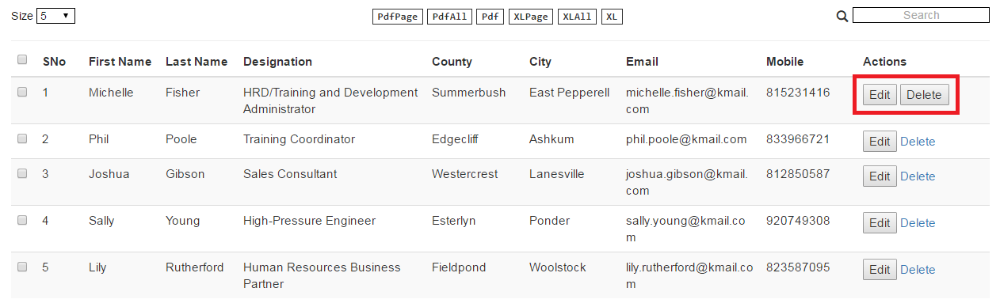

# PaginationX

PaginationX (X for extensible – explained in the design section below) is an Angular JS 1.4.4 based pagination directive. After trying out few already available open source solutions and realizing their shortcomings, I decided to create PaginationX. 

#### Highlights ####

- Very easy to add/remove a column for select all/few rows and a column for action elements (button/link). No coding is required. **All through static JSON configurations**.
- **High performance**. Number of angular watchers is negligible (only about 30-60 max).
- Support for **fast PDF/Excel export** (Credits to JsPDF and AlsSQL)
- Very **minimal to no coding** required (one of the most important design goals).
- Very flexible (multiple solutions to the same problem).

Please refer the Features and Design sections below for more details.

##1. Getting Started

Quickest way to get it running in your machine: 

1. Download the zip file. 
2. Deploy it in a web server by simply unzipping it into the right folder  (Eg., into the webapps directory in Tomcat server).
3. Three demos are included for your convenience with the source code (PaginationX was tested in Chrome 55.x Version): 
	1. **Simple** http://localhost:8080/pagination-x-master/demo-simple.html
	2. **Complex** http://localhost:8080/pagination-x-master/demo-complex.html
	3. **Multiple Instances** http://localhost:8080/pagination-x-master/demo-multiple-instances.html

For more details on the demos, please refer the '2. Demos' section below.

> **NOTE:** If you want to access it directly in Chrome without deploying in a web server, you need to enable CORS requests in Chrome. Run the following command (for windows 7) from windows run menu - 'chrome --disable-web-security --user-data-dir' to do it. If you close the browser and open again, web security will be enabled. Otherwise, you can use Firefox without the CORS issue.

For a step-by-step guide to use it in your application, please refer the '5.1 Setting up' section below.

##2. Demos

There are 3 demos for PaginationX available with the source code. To run them all in your local machine, please follow steps given in 'Getting Started' section above.

- **Simple Demo** 
	- Demo with minimal features - Only Search, Page Size List, Pagination Text, and Pagination Toolbar are available. Toolbar type is 'Links' (not the default Textbox) (For more details, please refer Developer Manual below).
	- Files: **demo-simple.html** and **controller-simple.js**
	- URL: http://localhost:8080/pagination-x-master/demo-simple.html
	- Screenshot:

The screen shot below shows the simple demo without the column search text boxes. They can be displayed/hidden on clicking the 'Search+' button displayed at the top of the table. The column search option, it's button position and label can be customized easily. Please refer 5.2.2 features section in the Developer Manual below for more details.

- **Complex** ( If you are new to pagination, please refer '3. Features' section below for the complete list of features )
	- Demo with most of the features.
	- Select column with the checkbox disabled for the first row (note the missing checkbox in the first row).
	- Action column with global action-column-options of an Edit button and Delete link. The global setting is overridden for the first row. Instead of Delete link, Delete button is added. Clicking the button calls event handlers in the controller. In the event handler, row details are logged to the console. Please enable Developer tools in Chrome to view the log.
	- All export options (The PDF document style customization is only for illustration. It doesn't look nice). 
	- Page size options
	- Selecting records using global checkbox or individual rows and clicking 'View Selected' button at the bottom logs out selected record details to the console.
	- Column County is highlighted in red for the first row using embedded HTML.
	- Clicking 'Change List' button at the bottom loads another list (to just illustrate reloading the page with new list).
	- Clicking 'Print Page' button at the bottom logs out details of all records currently displayed to the console. 
	- External event handlers (in controller) are mapped to the following events - search, page change, and page size change. Inside the event handlers, a log is printed to the console and then the built-in event handlers are called.
	- Files: **demo-complex.html** and **controller-complex.js**
	- URL: http://localhost:8080/pagination-x-master/demo-complex.html
	- Screen shot:

The screen shot below shows the complex demo without the column search text boxes. They can be displayed/hidden on clicking the 'Search+' button displayed at the top of the table. The column search option, it's button position and label can be customized easily. Please refer 5.2.2 features section in the Developer Manual below for more details.

- **Multiple Instances** 
	- Demo where multiple paginations are displayed on the same page.
	- Two different static lists of JSON objects are used.
	- Many of the features in the Complex demo are available here too (once you have gone through the Complex demo, all feature in this demo can be intuitively understood.
	- Files: **demo-multiple-instances.html** and **controller-multiple-instances.js**
	- URL: http://localhost:8080/pagination-x-master/demo-multiple-instances.html
	- Screen shot:

##3. Features
PaginationX is simple to use but rich in features. Important features are listed below.

- **Simple to use**
	- Do everything through static JSON configurations. No angular coding or HTML mark-up is required (except when you want to extend the directive behavior for some use cases) 
	- Getting started won't take more than few minutes
	- Any feature (except the table itself and the navigation toolbar below it) can be switched on/off
	- Simply adding the tag to angular template is enough. No need to add HTML mark-up for pagination
- **Select Column (optional)** 
	- An optional column with check boxes to select all records or specific records on a page.
	- Ability to make a particular row selectable / non-selectable through simple configuration change.
- **Action column (optional)** 
	- A column with buttons/links or both to do something on a particular row displayed.
	- 	- Handler function for buttons/links in controller can be easily mapped through a simple JSON object
	- If required, optionally add an id or class or both so that any JQuery event handler can handle an event 
	- Action column is displayed as the last column in the table. However, you can make any column in pagination-x an action column by embedding html/Angular templating elements. For more details, please refer '4. Design' section below. 
- **Export options**
	- Export to PDF/XLSX formats (Thanks to the libraries jsPDF and AlaSQL)
	- Export records on the page or all records or only selected/filtered records.
	- Optionally change/modify the columns to be exported for each export option (Upto 6 export options are available)
	- Optionally change the header names in exported files
	- Add your own formatting for PDF exports (using the jsPDF styling feature)
- **Navigation options** 
	- Navigation tool bar (displayed at the bottom right) can have links to pages or a text box where users can enter a page (handy if the number of pages is too large)
	- Two special buttons to get the next/previous set of page links apart from the usual next/previous/first/last buttons (applicable only if the navigation bar has links for pages)
- **Search**
	- By default, search looks through all displayed columns but search can be turned off for specific column(s). We can also add a different key for search or a multiple (comma separated) keys for a single column.
- **Column Search**
	- Column search let users search in individual columns and on multiple columns. Column search can be for exact or partial match. Please refer the '5.2.2 features' section below for details.
- **Page Size Options**
	- Page size options can be customized
	- Default page size (page size on load) can also be customized
- **Customizeable UI**
	- Most of the sections of the component can be customized through a separate CSS.

##4. Design

Some of the important design goals are:

- **High Performance** Minimal use of ng-repeat and two-way bindings and so less angular watchers. The number of watchers is less than 100 (depending on how many features are enabled) no matter how many rows are displayed. This will definitely not affect the performance of the page. Future versions may have zero watchers.
- **Easy Customization** Enabling or disabling features or customizing features should be very easy. All customizations are done through JSON based static configurations. No single line of JS code or HTML markup is needed. When you want to extend directive's behavior though, you have to add code in your Angular controller.
- **Extensible (The X in PaginationX)** The behavior of the directive for all important use cases can be easily extended. Users can completely change the behavior or just add some and use the default behavior. The API for important use cases and basic information about pagination is exposed as a simple JSON object. This object can be accessed in your Angular controller to extend/override default behavior. For details, please refer the Developer Guide below.
- **Very Flexible** Separation of concerns is one of the design goals of pagination-x. For example, to create an action column, we need not add any html or pieces of Angular JS templating code inside the JSON. However, if required, we can embed html/Angular templating code along with any formatting directly in your JSON. It is flexible.
- **Has its own scope** PaginationX uses isolate scope so that model values in controller are not updated or overwritten by mistake. Also, it is possible to use the directive multiple times on the same page (the data source should be different for each instance).
- **Skinnable** PaginationX uses a separate CSS for UI (To separate formatting from structure). Though some classes are already there in the directive's template (paginationx.html), almost all sections can be changed through the directive's style sheet (paginationx.css). 

   
##5. Developer Manual

### 5.1 Setting up
Following simple steps explain how to add PaginationX in few minutes to an application. 

The sample used for this illustration is a simple Employee Roster application with minimal features. The files for the sample are: demo-simple.html and controller-simple.js. On how to run the demo in your machine, please refer Getting Started section above. PaginationX has a rich set of easily configurable features that are explained in the Features section below. To view more complex samples, please refer Demos section above. 

#### 5.1.1 Adding dependencies
PaginationX module has only the following 3 files. All of them inside paginationx directory. Just include that directory: 

1. **paginationx.js** The script file with the directive definition.
2. **paginationx.html** The template for the directive.
3. **paginationx.css** The style sheet for the directive.

> **NOTE:** Make sure the path to the template file is relative to the root directory. Suppose, if it is in a folder with name 'paginationx' and this is directly inside the root folder (as in the example), the path to template is './paginationx/paginationx.html'. If it is a different path, please make changes in the directive definition object (in paginationx.js file). 

Following are the dependencies:

1. JQuery (Version - 1.12.4)
2. Angular (Version - 1.4.4)
3. AlaSQL (Version - 0.3.2) (This is used for exporting to Excel)
4. xlsx.core (Version - N/A) (Plugin used by AlaSQL)
5. jsPDF (Version - N/A) (This is used for exporting to PDF)
6. jsPDF-AutoTable (Version - 2.0.34) (Plugin used by jsPDF)
7. Bootstrap (Version - 3.3.6) (Minimally used for styling)

All these files are available with the project source for your convenience. Include them all into your project:
   
	<link rel="stylesheet" href=".\bootstrap\css\bootstrap.min.css">
	<link rel="stylesheet" href=".\paginationx\paginationx.css">

	
	
	
	
	
	
	

#### 5.1.2 Injecting paginationX module
Inject the paginationX module into your application's module. Suppose, myapp is your application's Angular module, then:

    'use strict';
	var myapp = angular.module('myapp',['paginationX']);

#### 5.1.3 Add directive to angular template

Add the directive to the angular template in the right location as shown below.
    
	<pagination-x id="id_emp_roster" features="features" columns="columns" list="employees"> </pagination-x>

#### 5.1.4 Controller
This sample has three attributes passed to the directive. Just have a look at how the values are passed in the controller as shown in the snippet below (The 'id' attribute is just a string to identify the directive instance uniquely. So it is not passed from controller). The meaning of attributes and how to pass values to them are explained in the Features section below.

	$scope.features = {"search":true, "pageSize":true, "paginationText":true};
	$scope.columns = [
		{title:"SNo",dataKey:"Sno",sortKey:"Sno",width:"5%"},
		{title:"First Name",dataKey:"firstname",sortKey:"firstname",width:"8%"},
		{title:"Last Name",dataKey:"lastname",sortKey:"lastname",width:"8%"},
		{title:"Designation",dataKey:"jobtitle",sortKey:"jobtitle",width:"20%"},
		{title:"County",dataKey:"county",sortKey:"county",width:"10%"},
		{title:"City",dataKey:"city",sortKey:"city",width:"10%"},
		{title:"Email",dataKey:"email",sortKey:"email",width:"15%",
			style:"overflow-wrap: break-word;word-wrap: break-word; word-break: break-all;"},
		{title:"Mobile",dataKey:"mobile",sortKey:"mobile",width:"10%"}
	];
	$scope.employees = [<Your JSON list goes here>];
	//Make sure the JSON object properties match the properties in the columns definition object above. 
	//A simple trick is to copy and paste the static JSON list from one of the demos. 

#### 5.1.5 Dynamically loading list
In the above example, we have loaded a static list (through the 'list' attribute). This is great for quick POCs. But in real time projects, we have to load list dynamically after getting it from the server. In this case, we have to load the list using the 'load' function of the pagination-x API. So, your HTML and controller code becomes:

**HTML:**

	<pagination-x id="id_emp_roster" features="features" columns="columns" pagination-x="pagination"> </pagination-x>

**Controller:**

	$scope.features = {"search":true, "pageSize":true, "paginationText":true};
	$scope.pagination = {}; // Added to access the pagination-x API
	$scope.columns = [
		{title:"SNo",dataKey:"Sno",sortKey:"Sno",width:"5%"},
		{title:"First Name",dataKey:"firstname",sortKey:"firstname",width:"8%"},
		{title:"Last Name",dataKey:"lastname",sortKey:"lastname",width:"8%"},
		{title:"Designation",dataKey:"jobtitle",sortKey:"jobtitle",width:"20%"},
		{title:"County",dataKey:"county",sortKey:"county",width:"10%"},
		{title:"City",dataKey:"city",sortKey:"city",width:"10%"},
		{title:"Email",dataKey:"email",sortKey:"email",width:"15%",
			style:"overflow-wrap: break-word;word-wrap: break-word; word-break: break-all;"},
		{title:"Mobile",dataKey:"mobile",sortKey:"mobile",width:"10%"}
	];
	$scope.employees = [<Your JSON list goes here>];
	//Make sure the JSON object properties match the properties in the columns definition object above. 
	//A simple trick is to copy and paste the static JSON list from one of the demos.

	$timeout( function() {
		$scope.pagination.load($scope.employees);
	}, 1);

> **WARNING: The $timeout service is used just to simulate the delay in loading data from the server. If you use static list and then use load, you may get an error because the pagintion-x API, assigned to the $scope.pagination object in controller may not be available immediately.** 

### 5.2 Customizing Features (Attributes) ##

PaginationX has a comprehensive set of features which can be customized through a set eleven attributes. Some of them are mandatory but most of them are optional. Each of the attributes, it's sub-attributes, and how to use them are explained in this section.

#### 5.2.1 id ##

This is a mandatory attribute if you want to use multiple instances of PaginationX on the same page. It is also useful to add different style to each of them in the CSS if required. You can pass the value directly in the template where you include the directive.

#### 5.2.2 features ##

The 'features' attribute is a mandatory attribute. It's value informs the directive what are the features you want on a page. It can be passed as a simple, static JSON object from the controller in whose scope the directive resides. The snippet below shows a feature object with all possible attributes. 

    $scope.features = {"selectColumn":true, "search":true, "columnSearch":true, "colSearchLabel":"Search+", "pageSize":true, 
		"paginationText":true, "export":true, "actionColumn":true};

I hope the meaning of each attribute can be intuitively understood from the names. Nevertheless, they are explained below:

- **selectColumn** 
	- If set to true, it adds a column at the beginning of the table to select all rows on a page or select individual rows. If it is not set or set to false, section column will not be added.
	- To turn it off for a particular row, add a 'selectable' attribute in the JSON object for that row and set it to false: selectable:false
	- To get the list of selected records, please refer the section for 'pagination' attribute below.
- **search**
	- If set to true, a text box with search icon is displayed at the top right above the table.
- **columnSearch**
	- If set to true, a text box is displayed under every column to search through only that column.
	- Users can search through multiple columns individually using the respective text box at the column header.
	- A button is displayed at the top above the table (with the default label 'Col Search'). By default text boxes are displayed for all searchable columns. Clicking this button toggles the display of these column search boxes.
	- If both 'search' and this options are enabled, only one is active at a time. For example, if user uses the 'search' option, automatically any/all individual search done by the user earlier is/are cleared and vice versa.
	- Column search can be for exact or partial match.
	- Please refer '5.2.4 columns' section to know how to configure different options.
- **colSearchLabel**
	- Lets developers set the label for the button displayed at the top above the table. Default value is 'Col Search'.
	- This button lets users toggle the display of column search text boxes displayed at the top of every searchable columns.
- **pageSize**
	- If set to true, a drop down is displayed with the following default page size values ['5', '10', '15', '25', '50'].
	- The drop down is displayed at the top left above the table with the label 'size'. Please refer 2.Demo section above for screen shots.
	- To change the number of options in the drop down and their values and to set the default page size on page load, please refer the section for 'pageSizeOptions' attribute below.
-   **paginationText**
	-   If set to true, the text with status (sample: 'Viewing 1 to 5 of 4001 records | Page 1 of 801 pages') is displayed at the bottom left of the table. 
-   **export**
	-   If set to true, two export options (buttons) are displayed at the top of the table - one for PDF and another for Xlsx format.
	-   To customize the number and other features of the export option, please refer the section for 'exportOptions' attribute below.
- **actionColumn**
	- If set to true, it adds an action column at the end of the table with button(s), link(s), or both to take some action on a particular row.
	- To add buttons and/or links and other features of the action column, please refer the section Action Column Configurations below.
	- Name for action column must be set in action-column-options attribute. For details, please refer section for action-column-options attribute below. By default, action column name is 'Actions'.

#### 5.2.3 list ##

This is a not mandatory attribute. This is an option for doing POCs quickly with hard-coded JSON list. The list of JSON objects to be displayed is assigned to it.
 
#### 5.2.4 columns ##

This is a mandatory attribute. This describes the options for each column in the table. The snippet below shows a sample columns attribute:

    $scope.columns = [
		{title:"SNo",dataKey:"Sno",sortKey:"Sno",width:"5%"},
		{title:"First Name",dataKey:"firstname",sortKey:"firstname",width:"8%"},
		{title:"Last Name",dataKey:"lastname",sortKey:"lastname",width:"8%"},
		{title:"Designation",dataKey:"jobtitle",sortKey:"jobtitle",width:"20%"},
		{title:"County",dataKey:"county",sortKey:"county",width:"10%",searchable:false},
		{title:"City",dataKey:"city",sortKey:"city",colSearchMatch:"exact",width:"10%"},
		{title:"Email",dataKey:"email",sortKey:"email",width:"15%",
			style:"overflow-wrap: break-word;word-wrap: break-word; word-break: break-all;"},
		{title:"Mobile",dataKey:"mobile",sortKey:"mobile",width:"10%"}
	];

Meaning and use of attributes (Again, the names are self explanatory I hope):

- **title** Mandatory property. This is the name of the header for the column.
- **dataKey** Mandatory property. This is the name of the attribute of the JSON object that has the value for a particular column.
- **sortKey** Mandatory property if sorting is required for a column. The property by which sorting should happen. 
- **width** Optional property. Gives the width for the column.
- **style** Optional property. Adds CSS style to the column.
- **searchable** Optional property. By default all columns are searchable. To turn off searching on a particular column, set this property to false. In the example above, column 'County' is not searchable since 'searchable' property is set to false.
- **searchKeys** Optional property. A single or multiple property names (separated by comma) to search for. This is for the global search option that searches through all columns.
- **searchKey** Optional property. The property name for an individual column search. If this is not given, the sortKey will be the key for searching for that column (this may be changed to dataKey) in the future.
- **colSearchMatch** Optional property. This specifies if the search is for exact or partial match. If set to 'exact', the matching is exact (case insensitive though). For example, 'ashkum' or 'ASHKUM' is considered a match for 'Ashkum'. The default matching is partial. In the above example, column city is configured for exact column search (...,colSearchMatch:"exact",...).
- **exportKey** Optional property. By default, the property used to display a column is exported. To change this, a different property can be specified using this attribute.

#### 5.2.5 page-size-options ##

This is an optional attribute. The snippet below shows a sample:
    
	$scope.pageSizeOptions = { pageSizeMenu:['5','10','15','25','50','100'], defaultSize:'5'};

It has only two attributes:

- **pageSizeMenu** Optional property. A list of options to be displayed in the drop-down menu. If it is not set, the default value is ['5', '10', '15', '25', '50'].
- **defaultSize** Optional property. The default page size option. On page load, this is automatically selected in the drop-down and only these many records are displayed. If it is not set, the default value is 10. 

#### 5.2.6 toolbar-options ##

This is an optional attribute. By default, navigation toolbar at the bottom right has the following options -First,Previous,Next, and Last buttons. In the middle, there is a text-box displaying current page number. User can change the page number here. This is very useful if the number of pages is very large. 

**Link Type Navigation Toolbar:**

If we want to have links to pages instead of text-box, we have to set the toolbarOptions attribute. The snippet below shows how to set this attribute to display page links in the navigation toolbar:

    $scope.toolbarOptions = {toolbarType:"link", linkSize:10};

It has two properties:

- **toolbarType** Optional property. Only possible value in PaginationX Version 1.0 is 'link'. If it is not set, instead of page links in the navigation toolbar, a text-box is displayed as explained above.
- **linkSize** Optional property. Sets the size of page links in the navigation toolbar. If it is not set, default value is 10.

The special buttons  and  are very handy to get the previous/next set of page links if the number of pages is very large.

**Textbox Type Navigation Toolbar:**

This is the default toolbar. This has a text box instead of page links between the usual set of buttons - First, Previous, Next, and Last. Entering page number in the textbox displays that page. If the page number is not valid, no change happens. 

#### 5.2.7 sort-by ##

This attribute can used to specify the column(s) by which the data should be sorted. If we want to sort the data by multiple columns, pass a comma separated string of the column names as the value. For example, to sort the list of employees by first name and county in the Employee Roster example, value is passed as follows:

    <pagination-x ... sort-by="firstname,county" ... ></pagination-x>

By default sorting is done in ascending order. If you want to sort any column in descending order, add '-' (minus) just before column name. For example, to sort the list by first name in ascending order and county in descending order, the above snippet can be changed to:

	<pagination-x ... sort-by="firstname,-county" ... ></pagination-x>

#### 5.2.8 action-column-options ##

This is an optional attribute. If you have enabled 'actionColumn' in 'features', you can use this attribute to set the action column options **globally**.

#### 5.2.8.1 Global Action Column Settings ###
The 'action-column-options' has action column settings for the entire action column, i.e., for all the rows in the action column. The snippet below shows an example of setting action-column-options in controller.

	$scope.actionColumnOptions = {
		title:"Actions",
		colWidth:"14%",
		htmlAttrbs:'id="act-col-id" class="act-col-class"',
		actions:[
			{name:"Edit", type:"Button", htmlAttrbs:'id="bt-edit" class="bt-edit-class"'}, // For Edit button
			{name:"Delete", type:"Link", href:"test.html", htmlAttrbs:'id="lnk-del-id" class="lnk-del-class"'} //For Delete link
		]
	};

- **title** Optional property. If action column feature is enabled, this gives header name to the action column. If not set, default value is 'Actions'.
- **colWidth** Optional property. The width for the action column.
- **htmlAttrbs** Optional property. The HTML attributes for the action column (which is a <td\> of HTML <table\>. This is a simple yet powerful option. Any number of HTML attributes can be set in a single string. From design perspective, this improves performance also (since we can avoid a concatenation operation internally for each attribute). In the sample snippet above, htmlAttrbs has both 'id' and 'class' HTML attributes of <td\>. You can give any number of HTML attributes verbatim as shown above. It should be a simple string as if copied from the <td\> settings of a HTML <table\>.
- **actions** Mandatory property. This is where the button(s) or link(s) or both for the action column are configured. For each button or link, a JSON definition object is added. In the sample snippet above, we have a button and a link. Following are the properties of this JSON object.
	- **label** Mandatory property. Label for the action button or link.
	- **name** Mandatory property. Name of the HTML button or link. This property is used to map the handler for the click event of the button or link in the 'action-handlers' attribute. Please refer section 'action-handlers' below for details.
	- **type** Optional property. Type of the action element. At the moment, only two types are supported - button and link. Default type is Button. It's value should be 'Button' for buttons and 'Link' for links.
	- **href** Mandatory property if 'type' is 'Link'. Gives the URL for the HTML link.

The snippet given above creates an action column with the header 'Actions', an Edit button, and a Delete link in each row of the action column as shown below:

> **NOTE:** The action column option is there to address the separation of concerns design goal. If we use it, we don't need to embed HTML or pieces of AngularJS template into the JSON objects (which is typically done in the AngularJS controller). However, if required, we can embed HTML or pieces of Angular JS template into any column to make it the 'action column'. All we have to do is simply add the HTML or pieces of Angular JS template code into the property for that column in the JSON object. 

#### 5.2.8.2 Overriding Global Action Column Settings for specific rows

- The 'actions' property of the 'action-column-options' explained above is for the entire action column, i.e., for all rows in the table. To override this common setting for specific rows, simply add a property with the name 'actions' to those rows and pass an object with the same set of properties as explained above as the value.
- If global 'actions' is overridden in a row, you have to give all the options there.
- Additionally, you can add a 'disabled' property and set it's value to 'true' to disable a button.
- To disable a link in a row, simply set it's href property to '#'

The snippet below overrides global 'actions' property for one row. Instead of an Edit button and a Delete link, we now have an Edit button and a Delete button.

    $scope.employees = [
		{"Sno":1,"firstname":"Michelle","lastname":"Fisher","county":"Summerbush","city":"East Pepperell" ...
		actions:[{name:"Edit", type:"Button", htmlAttrbs:'id="abc" class="def"'},
				 {name:"Delete", type:"Button", htmlAttrbs:'id="ijk" class="lmn"'}]},
		...
	];

Result is shown below:

#### 5.2.9 pagination-x (Attribute for the API)##

This is the attribute for the PaginationX API. This and the 'action-handlers' attribute help developers extend or override the directive's behavior. It's a simple javascript object that lets developers access the following properties and methods (functions) (Technically, functions are also properties of a javascript object but a function contains a method instead of data):

**Properties:**

- **currentPage** Property to get the current page number.
- **newPageNumber** Property to get the new page number requested by the browser when a page change event is fired.
- **startIndex** Property to get the index of the first record on the page.
- **endIndex** Property to get the index of the last record on the page.
- **pageSize** Property to get the page size option.
- **totalPages** Property to get the total number of pages.
- **searchText** Property to get the search string entered by user in the search box.
- **selectAll** Property to check if all the records on the page are selected or not. It is 'true' if all records are selected on the page and 'false' otherwise.

**Methods:**

- **setPage** Function handling page change event. Developer can override it.
- **search** Function handling search event. This function calls the setPage function internally. Developer can override it.
- **changePageSize** Function handling page size change event. This function calls the setPage function internally. Developer can override it.
- **getCurrentPageRecords** Function to get the list of records displayed on the current page. This function cannot be overridden.
- **getSelectedRecords** Function to get the list of records selected by the user. This function cannot be overridden.
- **handlePageSelection** Function to handle selection of all records on a page (by checking the global check box).
- **handleRecordSelection(object)** Function to handle selection of a single record (by checking the check box for a row). It is passed the object for that row as argument. 
- **load** Called to set the JSON list obtained from the server (usual scenario). Also, if the underlying list is changed dynamically (for example, after a re-query on the server), we can pass the new list to this function.
- **reload** If you want to set a new list of objects dynamically (for example, after a re-query on the server), call this method instead of the 'load' method. The 'load' method will also work. But it will add few more watchers every time it is called after the first loading.

The pagination-x attribute is an optional attribute for POCs. It makes things easy by saving time while working on POCs with hard-coded static list of JSON objects. But it is mandatory for real time projects. if you want to load the JSON list dynamically or access the data and functions explained above.
 
It is very easy to access the pagination-x object. Just create a blank javascript object and pass it's reference to the pagination-x attribute as shown below:

In controller:

	$scope.pagination = {};

In HTML:

    <pagination-x id="id_emp_roster" ... pagination-x="pagination" ... ></pagination-x>

> **NOTE:** As explained in the 'Methods' section above, handling of the following events can be customized - search, page change, and page size change. For more details and code snippets, please refer the 'action-handlers' section below. You can also go through the Demo code if required.

#### 5.2.10 action-handlers ##

This is an optional attribute. It is used to pass any custom event handling function in the controller to the directive. Like the pagination-x attribute, this is also a simple javascript object holding references to all custom event handlers in the controller.

**Extend/Override directive's behavior:**

To extend/override the directive's built-in event handlers for search, page change, page size change, page select, and record select events, pass the custom event handlers in the controller for these events as values for the properties 'search', 'pageChange', 'changePageSize', 'selectPage', and 'selectRecord' respectively.

In controller:

	$scope.handleSearch = function() {
		// Do something here
		console.log('search function in controller called: '+$scope.pagination.search);
		$scope.pagination.searchFn(); 
		// Call built-in event handling method. This should be avoided if you want to completely override built-in behavior.
	}

	$scope.handlePageChange = function() {
		// Do something here
		console.log('handlePageChange function in controller called: '+$scope.pagination.newPageNumber);
		$scope.pagination.setPage($scope.pagination.newPageNumber); 
		// Call built-in event handling method. This should be avoided if you want to completely override built-in behavior.
	}

	$scope.handleSizeChange = function() {
		// Do something here
		console.log('handleSizeChange function in controller called: '+$scope.pagination.pageSize);
		$scope.pagination.changePageSize(); 
		// Call built-in event handling method. should be avoided if you want to completely override built-in behavior.
	}

	$scope.handlePageSelection = function() {
		// Do something here if you want
		console.log('handlePageSelection function in controller called: ');
		$scope.pagination.handlePageSelection();
	}

	$scope.handleRecordSelection = function(object) {
		// Do something here if you want
		console.log('handleRecordSelection function in controller called: ');
		$scope.pagination.handleRecordSelection(object);
	}

	$scope.actionHandlers = {
		"search":$scope.search, 
		"changePage":$scope.handlePageChange, 
		"changePageSize":$scope.handleSizeChange,
		"selectPage":$scope.handlePageSelection,
		"selectRecord":$scope.handleRecordSelection,
		... // other event handlers
	};` 

In the above snippet, we call the built-in event handler for each event. This is optional. If you don't need any change in the built-in event handling logic but want to do something before or after the event, then you can do that before or after calling the built-in event handling method through the pagination-x object. So, you have the option to either completely override the directive's behavior for an event or add some of your own to the existing logic.

> **NOTE:** Create the object for action-handlers after defining the event handling functions as shown above. Otherwise, Angular JS may not properly map the functions (It happened quite a few times, it could be due to browser cache issue also).  

#### 5.2.11 export-options ##

This is an optional attribute. It has lots of options to change various features in the exported file (PDF/XLSX).
You can have a maximum of 6 export options. Three options each for PDF and Xlsx formats:

1. Export the current page 
2. Export all pages 
3. Export only the selected/filtered records (really useful and the only option you will need IMO). If you selected some records, only they are exported. If you have filtered records (without selecting any record) using the search filter, only the filtered records are exported. 

The snippet below shows export options for all six options:

	$scope.exportOptions = [
		{type:"pdf",records:"page",columns:pdfExportColumns,fileName:"Employee-Roster-Report",
			label:"PdfPage",style:pdfExportStyle,header:'Employee Report'},
		{type:"pdf",records:"all",columns:pdfExportColumns,fileName:"Employee-Roster-Report",
			label:"PdfAll",style:pdfExportStyle,header:'Employee Report'},
		{type:"pdf",records:"selected",columns:pdfExportColumns,fileName:"Employee-Roster-Report",
			label:"Pdf",style:pdfExportStyle,header:'Employee Report'},
		{type:"excel",records:"page",columns:excelExportColumns,fileName:"EmployeeRoster",label:"XLPage"},
		{type:"excel",records:"all",columns:excelExportColumns,fileName:"EmployeeRoster",label:"XLAll"},
		{type:"excel",records:"selected",columns:excelExportColumns,fileName:"EmployeeRoster",label:"XL"},
	];

	var pdfExportColumns = [
		{title: "SNo", dataKey: "Sno"},
		{title: "First Name", dataKey: "firstname"},
		{title: "Last Name", dataKey: "lastname"},
		{title: "Department", dataKey: "jobtitle"},
		{title: "County", dataKey: "county"},
		{title: "City", dataKey: "city"},
		{title: "Mobile", dataKey: "mobile"},
		{title: "Email", dataKey: "email"}
	];

	var excelExportColumns = [
		{title: "SNo", dataKey: "Sno"},
		{title: "First Name", dataKey: "firstname"},
		{title: "Last Name", dataKey: "lastname"},
		{title: "Job Title", dataKey: "jobtitle"},
		{title: "County", dataKey: "county"},
		{title: "City", dataKey: "city"},
		{title: "Mobile", dataKey: "mobile"},
		{title: "Email", dataKey: "email"}
	];

	var pdfExportStyle = {
		styles: { fillColor: [100, 255, 255],overflow: 'linebreak'},
		columnStyles: {id: {fillColor: 255}},
		margin: {top: 60},
	};

 >**NOTE:** The export buttons are displayed in the order in which they are in the array.

Meaning and use of all the properties of export-options object:

- **type** Optional property. The type of export. Right now, only two values are possible - PDF and excel. Both are enabled by default if 'export' is enabled in 'features'.
- **records** Optional property. As explained above, there are three options. Set it to 'page' to export only the current page records. Set it to 'all' to export all pages. Set it to 'selected' to export only selected or filtered records. This is the default value.
- **columns** Optional property. Specifies the columns to be exported and their names . If it is not set, all columns in the 'columns' attribute are exported. In the example above, there are two separate column arrays - one for PDF and one for Excel. A single definition can be used for both. For each column, only two properties are required - 'title' for header and 'dataKey' for the JSON attribute.
- **fileName** Optional property. Specifies the name of the exported file. If it is not set, default value is 'PdfReport' for PDF and 'ExcelReport' for Excel.
- **label** Optional property. Sets the name of the export button. If it is not set, default value is 'Pdf' for PDF and 'XL' for Excel.
- **style** Optional property. Applicable only for PDF export. This lets you format the PDF file to be exported. PaginationX uses JsPDF for PDF export (an excellent tool for PDF exports) For details please refer the JsPDF documentation.
- **header** Optional property. Applicable only for PDF export. This lets you give a title to be displayed at the beginning of the PDF file.

### 5.3 UI Customization

- **Global Configurations (style sheet)** The PaginationX directive uses a separate style sheet for most of the UI aspects of the component. It can be customized to suit project requirements. All this styling is in the **paginationx.css** file.

- **Cell level configurations** For fine grained UI control, PaginationX lets you embed HTML/CSS elements for each and every cell displayed in the pagination table. This lets add data dependent, conditional styling to individual cells in the table. For example, suppose we need to highlight county 'Summerbush' in red in the Employee Roster sample application. There are two solutions to this problem:
 1. **Dynamic (CSS) styling properties:** PaginationX lets developers add a dynamic styling property for each and every column inside the JSON list. Advantage in using this property is that you don't need to embed HTML content along with data. If HTML content is there in the table, it may be exported along with data when users export data. Also, using HTML inside JSON is not a good idea from the separation of concerns perspective. The naming convention for dynamic styling property is '<columnName>Style'. Here 'columnName' is the dynamic part. For example to highlight cells containing 'Summerbush' as value in the 'county' column, add a 'countyStyle' property to that particular row and pass the CSS class name as the value:
 
	`[
		{"Sno":1,"firstname":"Michelle","lastname":"Fisher", ...
			"county":"Summerbush","countyStyle":"county-style", ... },
		...
	];`

Here 'county-style' is a simple CSS class (.county-style { color:red; } ). Pagination-x uses HTML 'table' to display tabular data and this class is added to the particular cell ('td') of the table.

 2. **Embedding HTML** This is another way to add style to a cell in the table. But if user exports data, HTML markup is also exported. If you must use this solution, there is a workaround for this problem. Create a separate column for displaying. This column should not be part of the column list for export. Please refer section '5.2.11 export-options' for details on how to configure export columns. The snippet below shows how to use <span\> element to highlight the county column in red for the first record:
 
	`[
		{"Sno":1,"firstname":"Michelle","lastname":"Fisher", ... 
			"county":'Summerbush', ... },
		...
	];`

Result:

